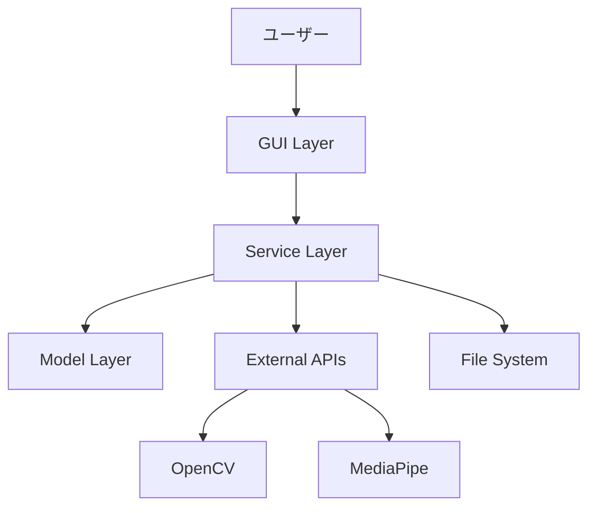

# 開発者ガイド

動画サムネイル抽出アプリケーションの技術仕様・開発環境構築・アーキテクチャガイド。

## 📋 目次

- [開発環境構築](#開発環境構築)
- [アーキテクチャ](#アーキテクチャ)
- [技術スタック](#技術スタック)
- [コーディング規約](#コーディング規約)
- [テスト](#テスト)
- [デバッグ](#デバッグ)
- [API仕様](#api仕様)
- [パフォーマンス](#パフォーマンス)

## 🛠️ 開発環境構築

### 前提条件

```bash
# 必須
Python 3.11+
Git
tkinter (通常Pythonに含まれる)

# 推奨
Visual Studio Code
PyCharm
Docker (コンテナ開発用)
```

### セットアップ

```bash
# 1. リポジトリクローン
git clone [リポジトリURL]
cd extract_thumbnail_from_video

# 2. 仮想環境作成
python -m venv .venv
source .venv/bin/activate  # macOS/Linux

# 3. 開発依存関係インストール
pip install -r requirements.txt
pip install -r requirements-dev.txt  # 開発用ツール

# 4. 開発用設定
pre-commit install  # Git hookセットアップ
```

### IDE設定

#### Visual Studio Code

```json
// .vscode/settings.json
{
    "python.defaultInterpreterPath": "./.venv/bin/python",
    "python.linting.enabled": true,
    "python.linting.flake8Enabled": true,
    "python.formatting.provider": "black",
    "python.testing.pytestEnabled": true,
    "python.testing.pytestArgs": ["tests/"]
}
```

#### PyCharm

```
Project Structure:
- Source Folders: src/
- Test Sources: tests/
- Excluded: .venv/, __pycache__/
```

## 🏗️ アーキテクチャ

### プロジェクト構造

```
extract_thumbnail_from_video/
├── src/                    # メインソースコード
│   ├── models/            # データモデル層
│   ├── services/          # ビジネスロジック層
│   ├── gui/              # プレゼンテーション層
│   ├── lib/              # 共通ユーティリティ
│   └── main.py           # アプリケーションエントリーポイント
├── tests/                 # テストコード
│   ├── unit/             # ユニットテスト
│   ├── integration/      # 統合テスト
│   ├── contract/         # 契約テスト
│   └── performance/      # パフォーマンステスト
├── specs/                 # 設計ドキュメント
├── scripts/              # 開発支援スクリプト
└── requirements.txt      # 依存関係定義
```

### レイヤーアーキテクチャ

```
┌─────────────────────────────────────┐
│          GUI Layer (src/gui/)        │
│  - MainWindow, SettingsDialog       │
│  - ThumbnailGrid, AsyncWorker        │
├─────────────────────────────────────┤
│      Service Layer (src/services/)   │
│  - VideoProcessor, FaceDetector     │
│  - ThumbnailExtractor, Diversity    │
├─────────────────────────────────────┤
│       Model Layer (src/models/)      │
│  - VideoFile, Thumbnail, Settings   │
│  - BoundingBox, Frame, Job          │
├─────────────────────────────────────┤
│        Lib Layer (src/lib/)          │
│  - Config, Logger, Errors           │
└─────────────────────────────────────┘
```

### データフロー



## 🔧 技術スタック

### コア技術

| カテゴリ | ライブラリ | バージョン | 用途 |
|----------|------------|------------|------|
| GUI | tkinter | Python標準 | デスクトップUI |
| 動画処理 | OpenCV | 4.8.1.78 | 動画読み込み・フレーム抽出 |
| AI/ML | MediaPipe | 0.10.9 | 顔検出・ランドマーク |
| 画像処理 | Pillow | 10.0.1 | 画像変換・保存 |
| 数値計算 | NumPy | 1.24.4 | 配列操作・数値処理 |
| 機械学習 | scikit-learn | 1.3.2 | 多様性分析・クラスタリング |

### 開発ツール

| カテゴリ | ツール | 用途 |
|----------|--------|------|
| テスト | pytest | ユニット・統合テスト |
| カバレッジ | pytest-cov | テストカバレッジ計測 |
| リンティング | flake8 | コード品質チェック |
| フォーマット | black | コード自動整形 |
| 型チェック | mypy | 静的型解析 |

## 📝 コーディング規約

### Python規約

```python
# PEP 8準拠
# 1. インポート順序
import os          # 標準ライブラリ
import sys

import cv2         # サードパーティ
import numpy as np

from .models import VideoFile  # ローカル

# 2. 命名規約
class VideoProcessor:           # CapWords
    def process_video(self):    # snake_case
        MAX_FRAMES = 1000       # UPPER_CASE定数
        frame_count = 0         # snake_case変数
```

### 型ヒント

```python
from typing import List, Optional, Dict, Any

def extract_thumbnails(
    video_file: VideoFile,
    count: int = 5,
    settings: Optional[UserSettings] = None
) -> List[Thumbnail]:
    """型ヒント必須"""
    pass
```

### ドキュメント

```python
def process_frame(self, frame: np.ndarray) -> List[FaceDetectionResult]:
    """
    フレームから顔を検出
    
    Args:
        frame: 入力画像フレーム (H, W, 3)
        
    Returns:
        検出された顔のリスト
        
    Raises:
        ProcessingError: 処理に失敗した場合
        
    Example:
        >>> processor = FaceDetector()
        >>> results = processor.process_frame(frame)
        >>> print(f"検出された顔: {len(results)}個")
    """
```

### エラーハンドリング

```python
# カスタム例外使用
from ..lib.errors import VideoProcessingError

try:
    result = self._process_dangerous_operation()
except Exception as e:
    self.logger.error(f"処理エラー: {e}", exc_info=True)
    raise VideoProcessingError(f"動画処理に失敗: {e}") from e
```

## 🧪 テスト

### テスト構造

```
tests/
├── unit/              # ユニットテスト（クラス・関数単位）
│   ├── test_models.py
│   ├── test_services.py
│   └── test_gui.py
├── integration/       # 統合テスト（複数コンポーネント）
│   ├── test_video_processing_pipeline.py
│   └── test_face_detection_integration.py
├── contract/          # 契約テスト（インターフェース）
│   └── test_service_contracts.py
├── performance/       # パフォーマンステスト
│   └── test_processing_speed.py
└── fixtures/          # テストデータ
    └── sample_videos/
```

### テスト実行

```bash
# 全テスト実行
pytest

# 特定テスト実行
pytest tests/unit/test_models.py

# カバレッジレポート
pytest --cov=src --cov-report=html

# 並列実行（高速化）
pytest -n auto

# コンポーネントテスト
python run_app.py --test
```

### テスト作成例

```python
# tests/unit/test_face_detector.py
import pytest
import numpy as np
from src.services.face_detector import FaceDetector

class TestFaceDetector:
    
    @pytest.fixture
    def detector(self):
        return FaceDetector(confidence=0.5)
    
    def test_detect_faces_valid_frame(self, detector):
        # テスト用フレーム作成
        frame = np.zeros((480, 640, 3), dtype=np.uint8)
        
        # 顔検出実行
        results = detector.detect_faces(frame)
        
        # 結果検証
        assert isinstance(results, list)
        assert all(hasattr(r, 'bounding_box') for r in results)
    
    def test_detect_faces_invalid_input(self, detector):
        with pytest.raises(ValueError):
            detector.detect_faces(None)
```

## 🐛 デバッグ

### ログ設定

```python
# src/lib/logger.py を使用
from src.lib import get_logger

logger = get_logger(__name__)

# ログレベル別使用
logger.debug("詳細なデバッグ情報")
logger.info("一般的な情報")
logger.warning("警告メッセージ")
logger.error("エラー情報")
logger.critical("致命的エラー")
```

### デバッグツール

```bash
# 1. コンポーネント別テスト
python run_app.py --test

# 2. 詳細ログ出力
LOG_LEVEL=DEBUG python run_app.py

# 3. プロファイリング
python -m cProfile -o profile.stats run_app.py

# 4. メモリ使用量監視
python -m memory_profiler run_app.py
```

### 一般的な問題と解決方法

```python
# 1. GUI無限ループ
# 原因: mainloop()の重複呼び出し
# 解決: アプリケーションクラスで一元管理

# 2. メモリリーク
# 原因: OpenCVフレームの未解放
# 解決: 明示的なクリーンアップ
try:
    frame = cv2.imread(path)
    # 処理
finally:
    if 'frame' in locals():
        del frame
        cv2.destroyAllWindows()

# 3. MediaPipe初期化エラー
# 原因: GPU/CPUリソース競合
# 解決: セッション管理
mp_face_detection = mp.solutions.face_detection
with mp_face_detection.FaceDetection() as face_detection:
    # 処理
```

## 📡 API仕様

### 主要クラスAPI

#### VideoProcessor

```python
class VideoProcessor:
    def load_video(self, file_path: Path) -> VideoFile:
        """動画ファイルを読み込み"""
        
    def extract_frames(self, video: VideoFile, count: int) -> List[Frame]:
        """代表フレームを抽出"""
        
    def get_video_info(self, file_path: Path) -> Dict[str, Any]:
        """動画メタデータ取得"""
```

#### FaceDetector

```python
class FaceDetector:
    def detect_faces(self, frame: np.ndarray) -> List[FaceDetectionResult]:
        """フレーム内の顔を検出"""
        
    def batch_detect(self, frames: List[np.ndarray]) -> List[List[FaceDetectionResult]]:
        """複数フレームの一括顔検出"""
```

#### ThumbnailExtractor

```python
class ThumbnailExtractor:
    def extract_thumbnails(
        self,
        video_file: VideoFile,
        settings: UserSettings
    ) -> List[Thumbnail]:
        """サムネイル一括抽出"""
        
    def save_thumbnail(self, thumbnail: Thumbnail, path: Path) -> bool:
        """サムネイル保存"""
```

### 設定API

```python
# 設定読み込み
from src.lib import get_config
config = get_config()

# 設定値取得
window_width = config.get('window_width', 1200)
max_frames = config.get('max_frame_buffer_size', 100)

# 設定値設定
config.set('default_thumbnail_count', 5)
config.save()  # 永続化
```

## ⚡ パフォーマンス

### メモリ管理

```python
# 1. フレームバッファ制限
MAX_FRAME_BUFFER = 100  # フレーム

# 2. 明示的ガベージコレクション
import gc
gc.collect()

# 3. OpenCVリソース解放
cv2.destroyAllWindows()
```

### 並列処理

```python
# 1. 非同期GUI処理
from threading import Thread
worker_thread = Thread(target=heavy_processing)
worker_thread.daemon = True
worker_thread.start()

# 2. フレーム処理並列化
from concurrent.futures import ThreadPoolExecutor
with ThreadPoolExecutor(max_workers=4) as executor:
    results = list(executor.map(process_frame, frames))
```

### パフォーマンス目標

| 処理 | 目標時間 | 条件 |
|------|----------|------|
| 動画読み込み | < 5秒 | 100MB以下 |
| 顔検出 | < 10秒 | 10分動画 |
| サムネイル生成 | < 30秒 | 10分動画、5枚 |
| GUI応答 | < 100ms | 操作反応 |

## 🚀 リリースプロセス

### バージョニング

セマンティックバージョニング（MAJOR.MINOR.PATCH）

```
1.0.0 - 初回リリース
1.0.1 - バグフィックス
1.1.0 - 機能追加
2.0.0 - 破壊的変更
```

### リリース手順

```bash
# 1. テスト実行
pytest
python run_app.py --test

# 2. バージョン更新
# src/__init__.py の __version__ を更新

# 3. ドキュメント更新
# README.md, CHANGELOG.md

# 4. Git タグ作成
git tag v1.0.0
git push origin v1.0.0

# 5. 配布用ビルド
python scripts/build_distribution.py
```

## 🔧 開発用スクリプト

```bash
# 開発環境リセット
scripts/reset_dev_environment.sh

# テストデータ生成
scripts/generate_test_data.py

# パフォーマンス計測
scripts/benchmark.py

# コード品質チェック
scripts/quality_check.sh
```

---

**最終更新**: 2025年9月5日  
**対応バージョン**: 1.0.0
